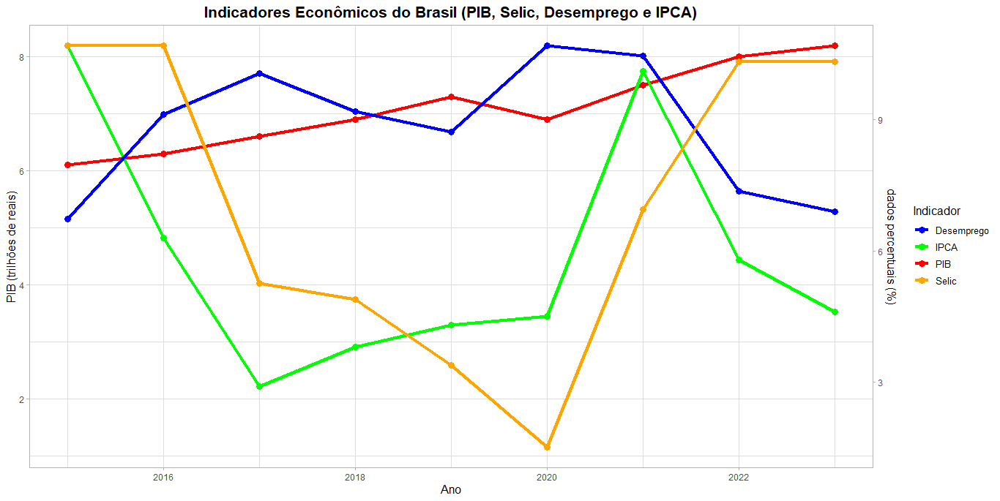

# Análise de indicadores econômicos do Brasil
projeto em R que visa análise estatisticas econômicas do Brasil ao longo dos anos, alguns desses dados são:

- PIB
- IPCA
- Selic
- Taxa de desemprego

## Objetivo

- O objetivo é aprender e refoçar minhas habilidades em R utilizando dados que são frequentemente utilizados em empresas e instituições, ou seja, no setor econômico.
- O objetivo do projeto em si é permitir uma análise visual clara da relação entre os principais indicadores econômicos, identificando padrões, tendências e possíveis correlações ao longo do tempo.

## Tecnologias usadas:

- **R**
- **ggplot2** para visualização dos dados
- **tidyverse** para manipulação dos dados

## gráfico:


## como executar o código:

```bash
git clone https://https://github.com/LIBRAE762/analise-economica-brasileira.git
